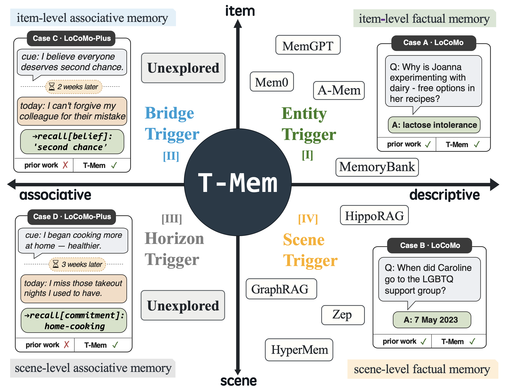
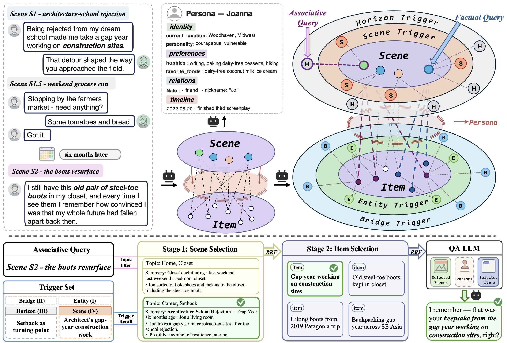

# 🧠 T-Mem: Memory That Anticipates, Not Archives

<div align="center">

### The first long-term conversational memory that covers both *descriptive* and *associative* recall — reaching state-of-the-art on LoCoMo and LoCoMo-Plus.

[](https://arxiv.org/abs/2606.15405)
[](https://github.com/Sherlockwz/T-Mem)
[](https://arxiv.org/abs/2606.15405)
[](LICENSE)

</div>

---

## 🥳 News

- **[2026-07-31]** Code and project page released.
- **[2026-06-15]** Paper available on [arXiv](https://arxiv.org/abs/2606.15405).
- **[2026-05]** T-Mem accepted to **EMNLP 2026**. 🎉

---

## 📑 Table of Contents

1. [Overview](#1-overview)
2. [Setup](#2-setup)
3. [Build Memory](#3-build-memory)
4. [Evaluate](#4-evaluate)
5. [Pipeline & Configuration](#5-pipeline--configuration)
6. [Tips](#6-tips)
7. [Citation](#-citation)

---

## 1. Overview

<div align="center">

</div>

Long-term memory is essential for conversational agents to stay coherent across
extended dialogues, follow through on commitments made many sessions earlier, and
adapt their behaviour to each user. Current LLM-backed long-term memory, however,
is **reachability-bounded** by the similarity between a query and stored content —
lexical or dense-vector. This works when query and memory share surface features
such as wording or named entities (we call this **descriptive** recall), but it
misses an equally common regime where query and memory share no surface form and
are tied only by a latent semantic arc (**associative** recall). Prevailing
long-term memory systems collectively fail on this second half.

**T-Mem** is the first long-term conversational memory architecture that covers
**both** descriptive and associative recall. At each of two evidence granularities —
single facts (**items**) and full exchanges (**scenes**) — T-Mem instantiates one
descriptive trigger family and one associative trigger family, so that every memory
remains reachable from both surface-similar and relevance-bound queries. These
write-time rehearsals — the engineering counterpart of *episodic future thinking* —
are what we call **triggers**.

### What This Project Does

The system runs as a two-stage workflow over a benchmark:

1. **Build Stage** (`scripts/build_memory.sh`) — segments dialogue into scenes,
   assigns topic labels, extracts atomic items, instantiates the four trigger
   families, builds BM25 + vector indexes, and extracts personas.
2. **Evaluate Stage** (`scripts/eval_*.sh`) — runs hierarchical
   topic → scene → item retrieval with associative-trigger augmentation, generates
   answers, and scores them with an LLM-as-judge.

<div align="center">

</div>

### Memory Structure

T-Mem stores conversational memory as a typed graph over five kinds of objects:

| Object | Symbol | Role |
|--------|--------|------|
| **Scenes** | $\mathcal{V}^{S}$ | Cohesive exchanges; passed to the QA LLM as evidence |
| **Items** | $\mathcal{V}^{I}$ | Atomic facts anchored to host scenes; QA evidence |
| **Topic labels** | $\mathcal{V}^{T}$ | Multi-label tags; scope extraction & pre-filter retrieval only |
| **Trigger families** | $\mathcal{T}^{\mathrm{Ent}}, \mathcal{T}^{\mathrm{Brg}}, \mathcal{T}^{\mathrm{Scn}}, \mathcal{T}^{\mathrm{Hor}}$ | One per quadrant of the design space; retrieval only |
| **Persona** | $\mathcal{X}$ | Per-speaker standing traits; injected as ambient context |

Three design commitments shape the graph: evidence layers stay **type-segregated**
(scenes and items retrieved at their own granularity); topic labels stay **off the
QA channel**; and triggers stay **off the evidence path**, decoupling *how* a memory
is reached from *what* is reached.

### Key Results

| Benchmark | Overall (LLM-judge) | vs. best baseline |
|-----------|:-------------------:|:-----------------:|
| **LoCoMo** | **80.26%** | +3.25 pp over HyperMem |
| **LoCoMo-Plus** | **74.81%** | State-of-the-art |

Token-level F1 on LoCoMo is **51.96**, corroborating the LLM-judge ranking. See the
[paper](https://arxiv.org/abs/2606.15405) for full per-question-type breakdowns,
ablations, and efficiency analysis.

### Supported Benchmarks

| Benchmark     | Dataset                    | #Convs | Mode in `build_memory.sh` |
|---------------|----------------------------|--------|----------------------------|
| LoCoMo        | `locomo10.json`            | 10     | `--mode locomo` (default)  |
| LoCoMo-Plus   | `locomo_plus.json`         | 401    | `--mode locomo_plus`       |
| LongMemEval-S | `longmemeval_s_cleaned.json` | 500  | `--mode lme`               |

---

## 2. Setup

### Environment

```bash
# Python 3.10+ recommended
pip install -r requirements.txt

# Optional: for JSON repair robustness
pip install json_repair
```

> **Note:** `venus_api_base` (Tencent Venus LLM SDK) is an internal dependency and
> is **not** on PyPI. It is used only by `T_mem/llm/venus_provider.py`. If you run
> the OpenAI backend only, you can skip it.

### Required Environment Variables

Create a `.env` file in the project root (it is git-ignored):

```bash
# OpenAI backend
OPENAI_API_KEY=sk-...

# Tencent Venus backend (optional — internal)
ENV_VENUS_OPENAPI_SECRET_ID=...
ENV_VENUS_OPENAPI_SECRET_KEY=...
VENUS_APP_GROUP_ID=...
```

### Prepare Data

Place the benchmark datasets under `benchmark_eval/` (datasets are not
redistributed in this repo):

- `benchmark_eval/locomo/data/locomo10.json`
- `benchmark_eval/locomo_plus/data/locomo_plus.json`
- `benchmark_eval/longmemeval/data/longmemeval_s_cleaned.json`

---

## 3. Build Memory

```bash
# LoCoMo (10 conversations)
bash scripts/build_memory.sh --mode locomo --tag my_run

# LoCoMo-Plus (401 per-sample libraries; smoke-test with 25 samples)
bash scripts/build_memory.sh --mode locomo_plus --tag smoke25 --limit 25

# LongMemEval-S (500 per-instance libraries)
bash scripts/build_memory.sh --mode lme --tag full
```

---

## 4. Evaluate

```bash
# LoCoMo
bash scripts/eval_locomo.sh --resume results/<experiment_dir>

# LoCoMo-Plus
bash scripts/eval_locomo_plus.sh --resume results/<experiment_dir>

# LongMemEval
bash scripts/eval_longmemeval.sh --resume results/<experiment_dir>
```

---

## 5. Pipeline & Configuration

### Pipeline Stages

| Stage | Name                          | Input                    | Output                                          |
|-------|-------------------------------|--------------------------|-------------------------------------------------|
| 0     | Stitch (LoCoMo-Plus / LME)    | raw dataset              | stitched `locomo10`-shape JSON                  |
| 1     | Scene Extraction              | stitched dialogues       | `scene_list_conv_*.json`                        |
| 2     | Memory Graph Extraction       | scenes                   | `memory_graph_conv_*.json`, `items_conv_*.json` |
| 3     | Index Building                | memory graphs            | BM25 `.pkl` + vector `.pkl` per conv            |
| 4     | L2/L3 Trigger Extraction      | scenes                   | `triggers_conv_*.json`                          |
| 5     | Per-QA Top-K (RRF Fusion)     | scenes + triggers        | `l2l3_topk_per_qa.json`                         |
| 6     | Hierarchical Retrieval        | all indexes + top-K      | `search_results.json`                           |
| 7     | Persona Extraction (optional) | scenes                   | `personas/`                                     |
| 8     | QA Generation                 | search_results + personas | `responses.json` / `hypothesis.jsonl`          |

### Configuration

All model IDs, retrieval top-K values, and directory paths live in
[`T_mem/config.py`](T_mem/config.py) under `ExperimentConfig`, overridable via
environment variables:

```bash
T_MEM_EXPERIMENT_NAME   # default: T_mem-v3
T_MEM_RESULTS_DIR       # default: <project_root>/results
T_MEM_DATA_FILE         # default: data/locomo10.json
T_MEM_FINAL_KEEP_SCENE  # default: 5   (final scenes in QA prompt)
T_MEM_FINAL_KEEP_ITEM   # default: 15  (final items in QA prompt)
T_MEM_USE_RERANKER      # default: true
```

### Project Structure

```
T-Mem/
├── T_mem/
│   ├── config.py         # ExperimentConfig (single source of truth)
│   ├── bootstrap.py      # LLM / Embedding / Reranker provider injection
│   ├── types.py          # Scene, MemoryItem, Topic dataclasses
│   ├── structure.py      # MemoryGraph (3-layer graph Pydantic models)
│   ├── extractors/       # scene / topic / memory-item / trigger extractors
│   ├── index/            # BM25 / vector / trigger index builders
│   ├── io/               # predictions adapter + search-result truncator
│   ├── llm/              # Venus / BGE-M3 / Qwen / tRAG providers
│   ├── main/             # Pipeline stages (stage0–stage8)
│   ├── persona/          # Persona profile extraction & QA support
│   ├── prompts/          # LLM prompt templates
│   ├── retrievers/       # trigger recaller
│   └── utils/            # datetime helpers + logger
├── benchmark_eval/
│   ├── locomo/           # LoCoMo judge + format converter
│   ├── locomo_plus/      # LoCoMo-Plus judge + data scripts
│   └── longmemeval/      # LongMemEval judge + smoke-subset maker
├── scripts/
│   ├── build_memory.sh   # Single entry point for all 3 modes
│   ├── eval_locomo.sh
│   ├── eval_locomo_plus.sh
│   └── eval_longmemeval.sh
├── assets/               # paper figures
├── requirements.txt
└── README.md
```

---

## 6. Tips

- **Concurrency & cost.** Build and evaluation issue many LLM calls; tune
  concurrency and watch API cost, especially on LoCoMo-Plus (401 convs) and
  LongMemEval-S (500 instances).
- **Resume mode.** Every `eval_*.sh` supports `--resume results/<dir>` to pick up
  a partially completed run without recomputing indexes.
- **Smoke test first.** Use `--limit 25` (or the smoke subsets under
  `benchmark_eval/`) to validate the full pipeline end-to-end before a full run.
- **Caching.** Intermediate stage outputs are written per-conversation, so
  re-running a later stage reuses earlier artifacts.

---

## 📌 Citation

If you find T-Mem useful in your research, please consider citing:

```bibtex
@inproceedings{guo2026tmem,
  title     = {T-Mem: Memory That Anticipates, Not Archives},
  author    = {Guo, Weidong and Wang, Dakai and Wang, Zixuan and Liu, Hui and Xu, Yu},
  booktitle = {Proceedings of the 2026 Conference on Empirical Methods in Natural Language Processing (EMNLP)},
  year      = {2026},
  url       = {https://arxiv.org/abs/2606.15405},
}
```

## 📄 License

This project is released under the [MIT License](LICENSE).
